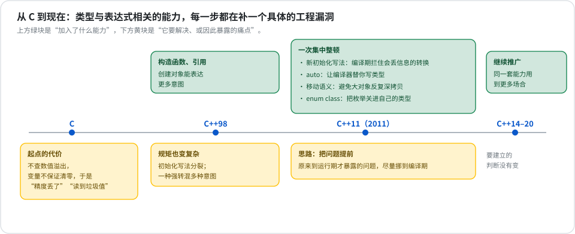
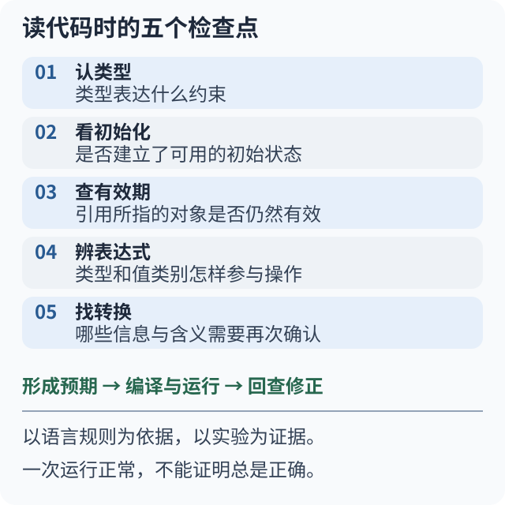

# 第 1 章 类型与表达式（教学大纲）

这是本章的教学大纲，按 ADR 0028 的八个字段组织：**痛点 → 来历 → 意图 →
基本问题 → 心智模型 → 判断点 → 边界与代价 → 落点**。它只讲方向，不讲语法
机制，也不绑定练习或实验——那些由学习页在这个框架内自行发挥。

## 痛点

在 C++ 把这些规则补齐之前，下面几类事情在真实项目里反复发生，而且大多不是
"初学者才会犯的错"，是几十年里最常见、最难查的一类缺陷：

- **精度悄悄丢了**。一个大数放进小盒子，编译器一声不吭，等到数字对不上时，
  出错的地方离真正的赋值已经隔了很远。
- **读到没写过的内存**。变量没有初始化就被使用，值是上一次留在那块内存里的
  垃圾。它时对时错，换台机器、换个编译选项就变样。
- **一种强转混了好几种意图**。"去掉 const""把指针当成另一种类型""在继承体系里
  向下转"——完全不同风险的操作长得一模一样，出了事没法从代码看出是哪一种。
- **大对象被反复深拷贝**。函数返回一个大容器，中间凭空多出几次完整复制，性能
  白白流失，而代码表面上看不出哪里发生了拷贝。
- **一组固定状态被当成整数**。两个本来不相干的枚举能互相比较、能参与算术，
  状态用混了编译器也不会拦。

## 来历

**C 留下的起点。** 最早，给变量赋初值只有等号一种像样的写法。它不检查"大数塞进
小盒子"，也不保证没赋过值的变量是干净的。规则少、好学，代价就是上面前两条痛点。

**C++ 的第一轮扩充。** 构造函数和引用让"创建对象"能表达更多意图。能力多了，
规矩也跟着复杂：初始化冒出好几种写法，彼此规则还不一样；"我到底是想拷一份，还是
想操作原件"这个区别，光看代码不容易看出来。

**2011 年的集中整顿（C++11）。** 这一版几乎是冲着前面的麻烦来的：加了一种能在
**编译期就拦住丢信息转换**的初始化写法；让编译器**替你写出类型**，因为泛型代码里
类型名又长又容易和右边对不上；引入**把资源让出去**的机制来避免大对象反复深拷贝，
这逼着语言把"一个表达式到底能不能被搬走"讲清楚；把枚举**关进自己的类型和作用域**，
堵住传统枚举到处泄漏的老问题。

**之后（C++14–20）。** 同一套想法一直往外推：让编译器写类型的能力用到了更多地方，
枚举、转换、初始化的规则也在继续细化。但要建立的那套判断，从 2011 年到现在没有变。

## 意图

一句话：**把"对象怎么诞生、表达式指着什么、类型变化谁把关"这三件事，变成读代码
时就能判断、编译期就能检查的明确规则**，而不是靠程序员的记性和运行期的运气。

注意它承诺的不是"更安全"或"更快"，而是**让意图在代码里显形**——你想要副本还是
别名、这次转换属于哪一类、这个值能不能被搬走，都要写出来，编译器才有可能替你把关。

## 基本问题

这四个问题贯穿全章。它们没有一劳永逸的答案，每读一段陌生代码都要重问一遍：

1. 这个对象是什么？它怎么拿到第一个值？
2. 手上这个表达式，指着一个能长期存在的对象，还是一个转瞬即逝的中间结果？
3. 类型要变的时候，谁来把关、什么时候把关？
4. 一组固定的取值，什么时候值得单独成为一个类型？

## 心智模型

C++ 程序从头到尾在做两件事：**造出对象**，再用一个个**表达式去读它、改它**。
本章五个看起来零散的小节，其实分布在同一条主线的三段上：

- **造出对象**——初始化决定值怎么进去、会不会丢；类型推导决定类型由谁来写。
- **读它、改它**——值类别决定手上的表达式是持久对象还是临时结果。
- **类型的边界谁来守**——类型转换决定跨类型时谁检查、在哪一层；`enum class`
  决定要不要给一组固定状态单独立一个类型。

把新遇到的语法往这三段上挂，就不会觉得它们是彼此无关的零碎规则。

## 判断点

学完这一章，面对陌生的 C++ 声明或表达式，你应该能按固定顺序问自己：先认类型和
它的修饰，再看初始化有没有边界风险，判断表达式是持久对象还是临时结果，确认类型
转换的检查在哪一层，遇到固定状态就考虑独立枚举。

每一节要你做的具体选择：

| 小节 | 它让你做的选择 |
|---|---|
| 初始化 | 按"这个值必须不丢失地进去吗"来选写法；决定要不要挡住隐式转换 |
| 类型推导 | 让编译器写类型之后，仍要自己决定"要副本还是要别名" |
| 值类别 | 先判断表达式属于哪一类，再推出它能绑到哪种引用、会选中哪个重载 |
| 类型转换 | 在几种转换里挑检查最严、意图最窄的那一种 |
| `enum class` | 判断一组固定状态是否值得脱离整数、单独成为一个类型 |

**这条判断链的产物是预期，不是答案。** 答案要靠真实程序给：形成预期 → 运行实验 →
观察结果 → 对照修正。预期和结果对不上的地方，就是这一章最该记住的内容。

## 边界与代价

这一章教的是判断，不是"永远用某种写法"。每一项能力都有代价：

- **编译期检查越严，写法越啰嗦。** 能拦住窄化的初始化写法，也会拒绝一些你本来
  觉得没问题的转换；挡住隐式构造，就得多写一次类型名。
- **让编译器写类型，省了手写，也让选择变得不显眼。** "要副本还是要别名"这个决定
  仍然在，只是从类型名里挪到了一个不起眼的符号上，更容易被忽略。
- **把资源让出去避免了深拷贝，换来一个新问题**：被移走之后的对象处于什么状态、
  还能不能用。
- **`enum class` 挡住了隐式转换，代价是**真的需要底层整数时要显式写出来。
- **命名转换比一种通用强转啰嗦**，换来的是出事时能定位到是哪一类转换。

## 落点

- **学这章之前**：知道变量、赋值、基本类型就够了。引用和 `const` 在本章按需讲。
- **对象寿命、把资源让出去** → 是「RAII 与资源管理」的地基。
- **让编译器写类型** → 「模板与泛型」里天天要用的工具。
- **值类别与引用绑定** → 函数重载决议和参数传递的基础。

## 想深入时的权威出处

- C++ 标准草案：[初始化](https://eel.is/c++draft/dcl.init)、[类型推导](https://eel.is/c++draft/dcl.type.auto.deduct)、[值类别](https://eel.is/c++draft/basic.lval)、[枚举](https://eel.is/c++draft/dcl.enum)
- [C++ Core Guidelines](https://isocpp.github.io/CppCoreGuidelines/CppCoreGuidelines)

## 小结

C++ 里和"类型与表达式"有关的语法，是几十年里一次次为具体工程事故打补丁攒起来的：
C 的宽松埋下"精度丢失""读到垃圾值"的隐患；C++ 用构造函数和引用换来表达力，也换来
初始化写法分裂、强转难审查的复杂度；C++11 集中做了一轮"把问题提前到编译期"的整顿；
之后一直在把同一套思想推广到更多场合。

它们承诺的不是"更安全"，而是**让意图在代码里显形**，编译器才有可能替你把关。这就是
为什么本章的四个基本问题都在追问"这是什么、指着谁、谁来检查"。

五个小节——初始化、类型推导、值类别、类型转换、`enum class`——分布在"造出对象 →
读它改它 → 类型的边界谁来守"这条主线的三段上，各自对着一类现实麻烦，但要建立的是
同一种能力：看到一段代码，能说清对象怎么来的、一次操作合不合法、该选哪种写法、
为什么。每项能力都有代价，所以这一章给的是判断依据，不是固定答案。

用这套框架先形成预期，再用真实程序去验证；冲突的地方，就是这一章真正的收获。
