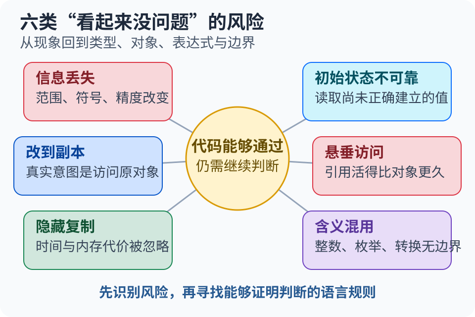
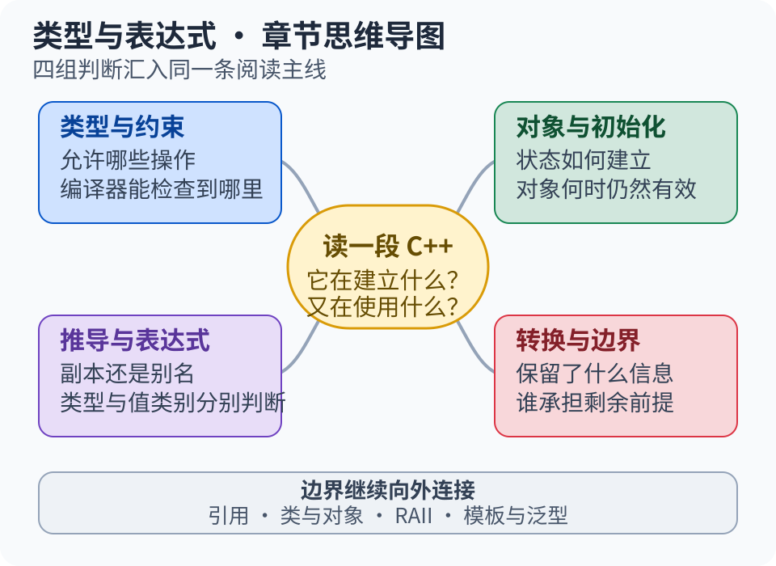
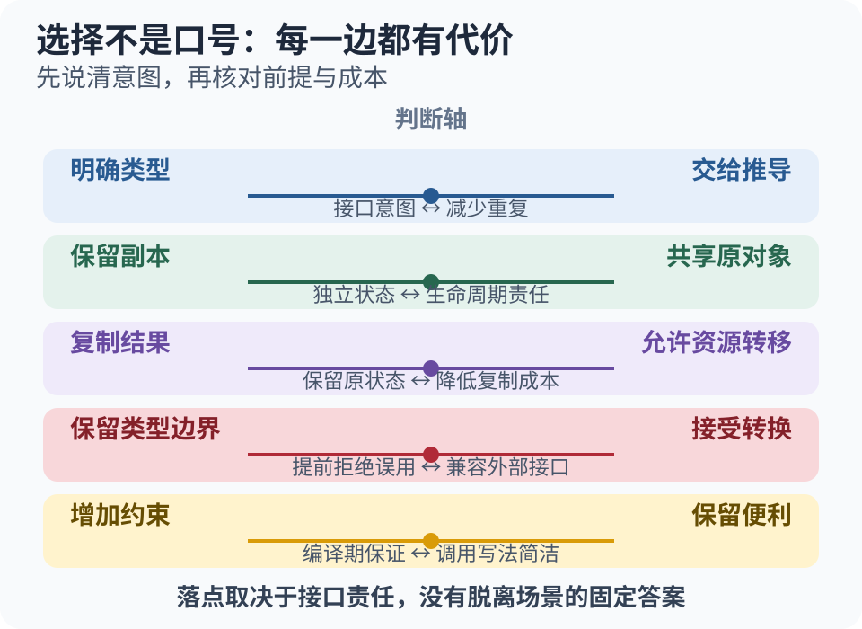

# 第 1 章 类型与表达式（教学大纲）

> 建立判断对象如何初始化、何时有效，以及表达式如何参与传递与转换的基本框架。

## 痛点与来历

读 C++ 代码时，只知道“这个变量存着什么”还不够。同一个结果，可能被复制，也可能
只是被另一个名字引用；看似普通的一次传递，可能丢失信息，也可能留下失效的引用。
本章从这些日常判断出发，把分散的语言规则连成一条线。

- **精度悄悄丢失。** 数值进入范围更小或表达能力不同的类型后，结果可能已经不是原来的值。
- **读取没有可靠初值的对象。** 代码可能表现不稳定，甚至直接进入未定义行为。
- **修改了副本，而不是原对象。** 写法很像，实际改变的对象却不同。
- **对象已经失效，引用仍被使用。** 表面上还能访问，实际已经越过对象的有效期。
- **一次传递产生了不必要的复制。** 对大对象而言，隐藏的复制会变成真实的时间和内存代价。
- **不同含义被当成同一种类型。** 枚举、整数和强制转换混在一起时，编译器很难替代码守住边界。

C++ 的演进既在增强表达能力，也在让这些意图更容易被检查。构造函数和引用让对象的
建立与使用有了更丰富的表达；C++11 集中扩展了初始化、推导、移动和枚举；后续标准
继续改进结果构造与类型表达。下面只取与本章有关的几个转折。

## 心智模型

先分清**对象**和**表达式**。对象是程序中具有身份、承载状态的实体；表达式是代码中
参与求值的部分，可以指向已有对象，也可以计算出用于后续操作或初始化的值。
多个表达式可以指向同一个对象，因此“写法不同”不一定意味着“多出了一份对象”。

本章先从对象的三个方面建立判断：

- **类型**：对象是什么，允许哪些操作，编译器能够检查什么。
- **状态**：对象是否已经正确初始化，此刻承载什么值或资源。
- **生命周期**：对象何时开始存在、何时结束，以及当前访问是否仍然有效。

再看表达式的两个方面：

- **类型**：表达式产生或指向什么类型的结果。
- **值类别**：表达式怎样参与引用绑定、重载选择等规则。

值类别描述表达式怎样参与操作，生命周期描述对象何时有效。二者需要分别判断：
不能靠“持久还是临时”直接判定值类别，也不能仅凭值类别保证发生移动；还要看类型、
可用操作和使用场景。这是本章最需要建立的区分。

带着四个问题阅读后面的知识点：

1. 这里建立了新对象，还是在访问已有对象？
2. 类型和初始化方式提供了哪些保证，又留下哪些责任？
3. 表达式怎样参与操作，它所指向的对象此时是否仍然有效？
4. 传递与转换保留了什么信息，付出了什么代价？

## 讲什么与边界

**类型与约束**

- 静态类型如何表达意图、限制操作，以及编译器能够检查到哪里。
- `const` 如何成为类型约束的一部分，以及只读访问和对象自身不可修改之间的区别。
- 类型别名如何改善表达，但不会建立新类型。
- 枚举何时应该脱离普通整数，形成独立的取值范围与作用域。

**对象与初始化**

- 初始化和后续赋值为什么是两个不同阶段。
- 不同初始化方式能够提供哪些保证，哪些转换需要特别警惕。
- 存储期与生命周期分别回答什么问题，对象何时真正开始和结束存在。
- 临时对象何时出现，引用何时可能延长它的寿命，何时会留下悬垂访问。

**推导与表达式**

- `auto` 推导时哪些类型信息会保留、哪些会改变，怎样区分副本与别名。
- `decltype` 为什么关注表达式本身，以及它和 `auto` 回答的问题有什么不同。
- 表达式的类型和值类别为什么必须分开判断。
- 左值、纯右值和将亡值如何影响引用绑定与操作选择。
- 类型推导为什么不能替代“我要副本还是原对象”的意图判断。

**转换与边界**

- 哪些类型变化会隐式发生，范围、符号和精度可能怎样改变。
- 显式转换分别在表达什么意图，编译器能够检查到哪里。
- 为什么“写出了转换”只说明程序员作出了决定，并不能证明转换安全。

这些内容在本章讲到能够阅读、预测和说明选择依据的程度。相邻内容按下面的边界继续展开：

- 引用在本章先建立别名与有效期的基本认识；完整的绑定、传参与返回规则进入「引用」章。
- 类的构造与析构如何实现，以及运算符如何重载，进入「类与对象」。
- 资源所有权、移动构造和移动赋值如何实现，进入「RAII 与资源管理」。
- 模板参数推导、约束与概念的完整规则，进入「模板与泛型」。
- 整型提升和运算符规则按理解所需引入；内存布局与 ABI 不在本章展开。

## 判断与代价

面对陌生代码，可以沿着下面的线索检查；实际阅读时允许往返，不必机械地走固定步骤。

阅读时可以反复使用这五个检查点：

1. **认类型**：对象和表达式分别是什么类型，`const` 与引用修饰了哪一层。
2. **看初始化**：对象怎样取得初始状态，是否存在信息丢失或未初始化风险。
3. **查有效期**：对象此刻是否仍然存在，引用会不会活得比所指对象更久。
4. **辨表达式**：表达式的类型和值类别怎样影响绑定、重载与后续操作。
5. **找转换**：转换在哪里发生，是隐式还是显式，哪些前提仍需程序员保证。

这些检查最终会落到几组经常出现的选择上：

- **明确类型，还是交给推导？** 推导减少重复，也能适应复杂类型；明确写出类型能够直接
  表达接口意图。两者都需要检查是否保留了所需的只读约束与引用关系。
- **保留副本，还是共享原对象？** 副本让后续修改相互独立，但可能带来复制代价；引用
  避免复制，却要求关心原对象的有效期以及修改是否会影响其他使用者。
- **复制结果，还是允许资源转移？** 要先判断是否仍需保留原对象的状态，再结合类型提供
  的操作作决定。允许移动并不保证移动发生。
- **接受转换，还是保留类型边界？** 更严格的初始化与独立枚举类型能拦住一部分误用；
  与外部数据或旧接口交互时，仍需检查范围、含义和前提。
- **增加编译期约束，还是保留接口便利？** 约束能提前暴露错误，也可能要求调用者把意图
  写得更明确；选择取决于接口承担的责任，而不是一味追求写法最短。

先依据语言规则形成预期，再结合编译诊断与运行结果检验理解。一次运行正常不能证明
代码总是正确，尤其不能据此排除未定义行为；结果不符合预期时，应回查规则与前提。

## 落点

- **学习前提**：知道变量、赋值和基本类型即可；引用与只读约束会在这里建立初步认识。
- **本章结果**：能够说明简单代码中对象与表达式的关系，分清副本和别名，指出初始化、
  有效期与转换中需要核对的地方，并解释选择依据。
- **后续连接**：这套判断会继续用于「引用」中的传参与返回、「RAII 与资源管理」中的
  所有权与资源转移，以及「模板与泛型」中的类型推导。

遇到细节疑问时，按主题回查 C++20 规则：

- [初始化](https://timsong-cpp.github.io/cppwp/n4861/dcl.init)、[生命周期](https://timsong-cpp.github.io/cppwp/n4861/basic.life)
- [类型推导](https://timsong-cpp.github.io/cppwp/n4861/dcl.spec.auto)、[值类别](https://timsong-cpp.github.io/cppwp/n4861/basic.lval)
- [类型转换](https://timsong-cpp.github.io/cppwp/n4861/expr.cast)、[枚举](https://timsong-cpp.github.io/cppwp/n4861/dcl.enum)

## 小结

本章用对象与表达式两条线组织初始化、类型推导、值类别、转换和枚举。对象这一侧
关注类型、状态与有效期；表达式这一侧关注类型和值类别，以及它们怎样参与操作。
把两条线联系起来，才能判断是在创建副本、访问原对象，还是允许某种资源转移。

回顾时尤其检查这些误区：

- 值类别不等于对象寿命。
- 使用引用不等于对象一定仍然有效。
- 允许移动不等于实际一定发生移动。
- 交给编译器推导不等于不再需要表达副本或别名的意图。
- 显式转换不等于安全转换。

先说明意图与前提，再依据规则作出判断，用实验检验并修正理解。
