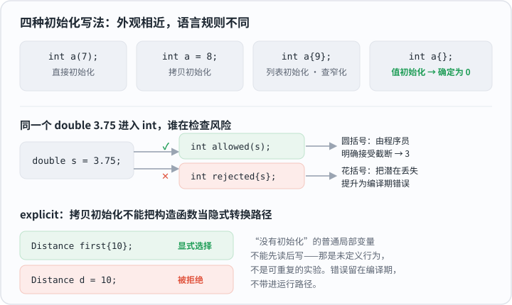
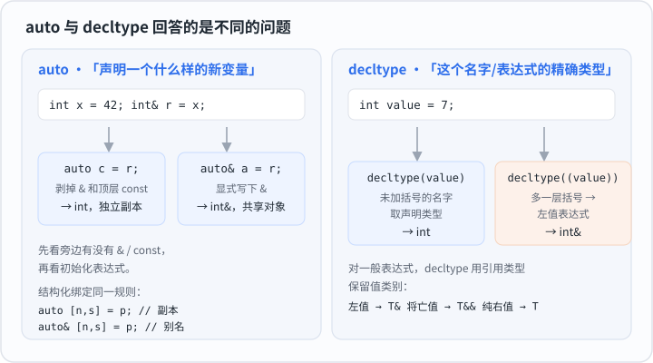
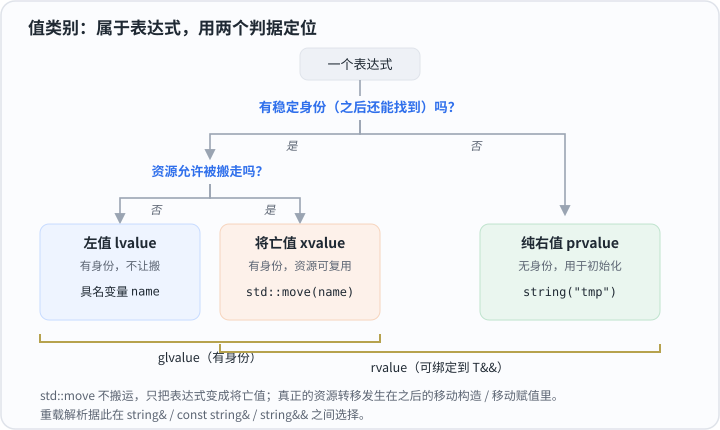
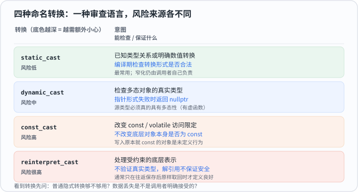
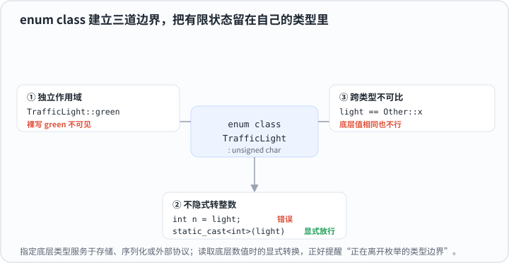
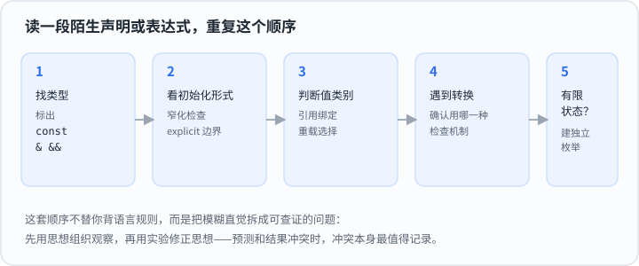

# 第 1 章 类型与表达式

C++ 程序不断在做两件事：**创建对象**，以及**用表达式操作对象**。许多看似零散的语法——花括号、`auto`、引用、`std::move`、类型转换——都可以放回这两条主线理解。

阅读一段代码时，先问四个问题：

1. 对象的类型是什么？
2. 对象怎样获得初始值？
3. 当前表达式指向持久对象，还是产生临时结果？
4. 类型发生变化时，谁在检查风险？

本章先建立判断方法，再用实验验证判断。实验不是正文的替代品：运行之前先写下预测，运行之后只比较“预测与事实哪里不同”。

## 1.1 初始化

初始化不是“先创建，再赋值”。对象从生命周期开始就按照某种规则取得初始状态。下面四种写法结果相近，但语言规则并不相同：

```cpp
int direct(7);   // 直接初始化
int copied = 8;  // 拷贝初始化
int listed{9};   // 列表初始化
int zero{};      // 值初始化
```

选择语法时，最值得关注的不是括号外观，而是两个边界。

**边界一：列表初始化检查窄化。**

```cpp
double source = 3.75;
int allowed(source);   // 合法，结果是 3
// int rejected{source};  // 编译错误
```

`int` 无法保存小数部分。圆括号允许程序员明确接受这次转换；花括号把潜在丢失提升为编译错误。需要表达“这个值必须无损进入目标类型”时，花括号更能暴露错误。

**边界二：`explicit` 阻止隐式进入。**

```cpp
class Distance {
public:
    explicit Distance(int metres) : metres(metres) {}

private:
    int metres;
};

Distance first{10};
// Distance second = 10;  // 编译错误
```

`explicit` 表示“从整数到距离的转换必须由调用者说清楚”。直接初始化可以显式选择这个构造函数，拷贝初始化不能把它当作隐式转换路径。



*同一个值进入 `int`，圆括号让程序员承担截断，花括号把丢失提升为编译错误。*

还要区分“值初始化为零”和“没有初始化”：

```cpp
int safe{};     // 确定为 0
int unknown;    // 普通局部变量，不能先读后写
```

***不要读取未初始化的普通局部变量来观察它“碰巧是什么”。*** 那不是实验，而是未定义行为。学习实验应当让现象可重复，所以错误示例保留在编译期，不把风险带进运行路径。

运行本节实验前，先预测：哪种写法得到零，哪种转换会被花括号拒绝，`explicit` 构造函数能否参与拷贝初始化。

## 1.2 类型推导

`auto` 与 `decltype` 都能得到类型，但它们回答不同的问题：

| 工具 | 核心问题 | 常见用途 |
|---|---|---|
| `auto` | 用初始化表达式声明一个什么样的新变量？ | 保存计算结果，减少重复类型 |
| `decltype` | 这个名字或表达式的精确类型是什么？ | 泛型代码、返回类型、保留引用信息 |

`auto` 按值声明变量时，会得到一个新对象，引用和顶层 `const` 不再属于新对象：

```cpp
int original = 42;
int& reference = original;

auto copy = reference;   // int，独立副本
auto& alias = reference; // int&，共享同一对象
```

因此判断 `auto` 时，先看它旁边有没有 `&` 或 `const`，再看初始化表达式。不要把“编译器帮我写类型”误解成“无条件原样复制类型”。

结构化绑定仍遵守同一选择：

```cpp
pair record{string("Athena"), 5};
auto [name, score] = record;        // 拆出副本
auto& [same_name, same_score] = record; // 拆出别名
```

`decltype` 有一条必须单独记住的分界：**未加括号的名字**与**一般表达式**采用不同规则。

```cpp
int value = 7;

decltype(value) a = 1;       // int：取变量的声明类型
decltype((value)) b = value; // int&：(value) 是左值表达式
```

多出一层括号后，问题从“这个变量怎样声明”变成了“这个表达式属于什么值类别”。对一般表达式，`decltype` 会用引用类型保留值类别：左值得到 `T&`，将亡值得到 `T&&`，纯右值得到 `T`。



*`auto` 问“声明一个什么样的新变量”，`decltype` 问“这个名字或表达式的精确类型是什么”。*

本节安排两个实验，因为一个小节可以建立一组概念，再从不同角度验证。先预测：修改 `auto` 副本会不会改变原对象；`decltype((value))` 为什么不是 `int`。

## 1.3 值类别

类型描述“能做什么”，值类别描述“表达式怎样关联对象”。值类别属于表达式，不属于变量本身的永久标签。

| 值类别 | 直观含义 | 典型表达式 |
|---|---|---|
| 左值 | 有稳定身份，可以在之后再次找到 | 具名变量 `name` |
| 纯右值 | 用于计算或初始化的临时结果 | `string("temp")` |
| 将亡值 | 仍有身份，但资源允许被复用 | `std::move(name)` |



*两个判据定位三类表达式：有身份的是 glvalue，可被搬走的是 rvalue，将亡值同时属于两者。*

这一区分会直接参与引用绑定与重载选择：

```cpp
void inspect(string&);        // 可修改左值
void inspect(const string&);  // 只读观察
void inspect(string&&);       // 纯右值或将亡值
```

最容易产生误解的是 `std::move`。它不执行搬运，只把表达式转换成将亡值：

```cpp
string name = "Athena";
std::move(name);  // 没有接收者，此处并未搬走字符串
```

真正的资源转移发生在后续的移动构造、移动赋值或接收右值引用的操作中。把 `std::move` 理解成“允许别人搬”，比理解成“立即搬走”更准确。

运行实验前，先预测具名对象、临时对象和 `std::move(name)` 会选择哪一个重载；再观察一次没有接收者的 `std::move` 是否改变原字符串。

## 1.4 类型转换

转换语法不仅改变类型，也表达风险来自哪里。C 风格强转把多种操作压成同一种外观，命名转换则让意图可以被编译器和读者检查。

| 转换 | 表达的意图 | 能保证什么 |
|---|---|---|
| `static_cast` | 已知类型关系或明确数值转换 | 编译期检查转换形式是否合法 |
| `dynamic_cast` | 检查多态对象的真实类型 | 指针失败返回 `nullptr` |
| `const_cast` | 改变 `const`/`volatile` 访问限定 | 不改变底层对象本身是否为 const |
| `reinterpret_cast` | 处理受约束的底层表示 | 不验证对象真实类型，不保证解引用安全 |



*底色越深越需要额外小心：从 `static_cast` 的编译期检查，到 `reinterpret_cast` 完全不验证真实类型。*

```cpp
Base* base = get_object();
if (auto* derived = dynamic_cast<Derived*>(base)) {
    derived->use_feature();
}
```

命名转换不是“写得更长的强转”，而是一种审查语言。看到转换时，应继续追问：

- 普通隐式转换是否已经足够？
- 数据丢失是不是调用者明确接受的？
- `dynamic_cast` 的源类型是否真的具有多态性？
- 去掉 `const` 后，底层对象原本是否可修改？
- 底层表示转换后是否只是往返保存，还是要进行可能无效的访问？

本节实验只演示定义良好的边界。先预测多态向下转换失败时会发生什么，以及 `reinterpret_cast` 的指针往返究竟证明了什么、没有证明什么。

## 1.5 枚举类型

当一个概念只有有限、互斥的状态时，应让状态留在自己的类型里，而不是退化成整数或字符串。

```cpp
enum class TrafficLight : unsigned char {
    red = 1,
    yellow = 2,
    green = 3,
};

TrafficLight light = TrafficLight::green;
```

`enum class` 建立三道边界：

1. 成员位于枚举自己的作用域中，使用时写 `TrafficLight::green`。
2. 枚举值不会隐式变成整数参与运算。
3. 不同枚举类型不能因为底层值相同就随意比较。



*三道边界把有限状态挡在类型里；显式 `static_cast<int>` 是唯一放行的门，也是“正在离开枚举边界”的提醒。*

指定底层类型主要服务于存储布局、序列化或外部协议。需要读取底层数值时显式转换，正好提醒读者“现在正在离开枚举的类型边界”。

运行实验前，先预测 `TrafficLight` 能否隐式转换为 `int`，以及两个不同的 `enum class` 能否直接比较。

## 1.6 阅读顺序

面对陌生 C++ 声明或表达式，可以重复使用下面的顺序：

1. 先找类型，标出 `const`、`&` 和 `&&`。
2. 再看初始化形式，判断窄化与 `explicit` 边界。
3. 判断表达式的值类别，推测引用绑定和重载选择。
4. 发生转换时，确认使用哪一种检查机制。
5. 遇到有限状态集合时，优先建立独立的枚举类型。



*这条顺序不替你背语言规则，而是把每一步都变成一个能查证的问题。*

这套顺序的价值不在于替你背完语言规则，而在于把模糊直觉拆成可查证的问题。先用思想组织观察，再用实验修正思想；当预测与结果冲突时，冲突本身就是最值得记录的学习内容。

## 小结

本章把 C++ 里零散的语法收拢到两条主线上：**创建对象**和**用表达式操作对象**。

- **初始化**决定对象从生命周期开始就取得的状态。真正的分界不在括号外观，而在两个边界：花括号检查窄化、把潜在丢失提升为编译错误；`explicit` 阻止构造函数成为拷贝初始化的隐式转换路径。`int x{}` 确定为零，`int x;` 是不能先读后写的未初始化变量。
- **类型推导**里，`auto` 回答“声明一个什么样的新变量”，按值声明会剥掉引用和顶层 `const`；`decltype` 回答“这个名字或表达式的精确类型是什么”，对未加括号的名字取声明类型，对括号包住的表达式则按值类别给出 `T&` / `T&&` / `T`。
- **值类别**属于表达式而非变量：用“有稳定身份吗”“资源允许被搬走吗”两个判据，区分左值、将亡值、纯右值。`std::move` 不搬运任何东西，只是把表达式变成将亡值，允许后续操作来搬。
- **类型转换**中，四种命名转换是一门审查语言：`static_cast` 编译期检查形式，`dynamic_cast` 运行期检查多态真实类型，`const_cast` 只改访问限定、不改对象本身的常量性，`reinterpret_cast` 不做任何验证。C 风格强转把这些意图压成同一种外观，因而更难审查。
- **枚举类型**用 `enum class` 建立三道边界——独立作用域、不隐式转整数、跨类型不可比——把有限状态关在自己的类型里；需要底层数值时的显式转换，正好是“正在离开边界”的提醒。

常见误区：把“编译器帮我写类型”当成“无条件原样复制类型”；以为 `std::move` 会立即搬走资源；把 `decltype(x)` 和 `decltype((x))` 当成一回事；把命名转换当成“写得更长的强转”而不追问风险来源；用整数或字符串代替本该独立的枚举类型。

遇到陌生声明时，按 1.6 的五步顺序走一遍：先定类型和限定符，再看初始化形式，判断值类别，确认转换的检查机制，最后留意是否该引入枚举。先用框架形成预测，再用实验修正框架——预测和结果冲突的地方，就是最值得记录的学习内容。

**延伸阅读**：[C++ 工作草案：初始化](https://eel.is/c++draft/dcl.init)、[列表初始化](https://eel.is/c++draft/dcl.init.list)、[`auto` 推导](https://eel.is/c++draft/dcl.type.auto.deduct)、[`decltype`](https://eel.is/c++draft/dcl.type.decltype)、[值类别](https://eel.is/c++draft/basic.lval)、[强类型枚举](https://eel.is/c++draft/dcl.enum)，以及 [C++ Core Guidelines](https://isocpp.github.io/CppCoreGuidelines/CppCoreGuidelines)。
